# CubeStor

[](https://www.cncf.io/projects)
[](https://github.com/cubefs/cubefs/actions/workflows/ci.yml)
[](https://github.com/cubefs/cubefs/blob/master/LICENSE)
[](https://golang.org/)
[](https://goreportcard.com/report/github.com/cubefs/cubefs)
[](https://cubefs.io/docs/master/overview/introduction.html)
[](https://www.bestpractices.dev/projects/6232)
[](https://securityscorecards.dev/viewer/?uri=github.com/cubefs/cubefs)
[](https://codecov.io/gh/cubefs/cubefs)
[](https://artifacthub.io/packages/helm/cubefs/cubefs)
[](https://clomonitor.io/projects/cncf/chubao-fs)
[](https://app.fossa.com/projects/git%2Bgithub.com%2Fcubefs%2Fcubefs?ref=badge_shield)
[](https://github.com/cubefs/cubefs/releases)
[](https://github.com/cubefs/cubefs/tags)
[](https://gurubase.io/g/cubefs)

# CloudStor — Cloud-Native Distributed Storage Data Plane 🚀

*A cloud-native distributed storage data plane engineered around scalable metadata management, distributed data placement, replication, erasure coding, object storage, multi-tenancy, caching, and fault-tolerant coordination.*

> [!IMPORTANT]
> **Mission:** Build a unified distributed storage data plane capable of serving file, object, and large-scale data workloads while maintaining strong metadata consistency, scalable data placement, storage durability, and cloud-native deployment capabilities.

<p align="center">
  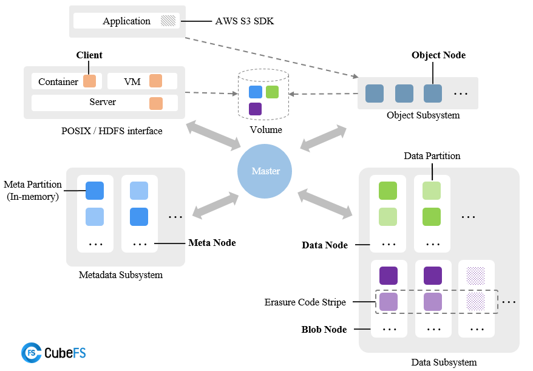
</p>

[](https://go.dev/)
[](#architecture-overview)
[](#metadata-consistency--raft)
[](#storage-engine)
[](#object-storage)
[](#multi-protocol-access)
[](#multi-protocol-access)
[](docker/)
[](#kubernetes-deployment)
[](#kubernetes-deployment)
[](#observability)
[](LICENSE)

---

## Table of Contents

* [Why CloudStor](#why-cloudstor)
* [What CloudStor Solves](#what-cloudstor-solves)
* [Feature Matrix](#feature-matrix)
* [Architecture Overview](#architecture-overview)

  * [Control Plane](#control-plane)
  * [Data Plane](#data-plane)
  * [Metadata Plane](#metadata-plane)
  * [Object Storage Plane](#object-storage-plane)
* [End-to-End Data Flow](#end-to-end-data-flow)
* [Quick Start](#quick-start)

  * [Prerequisites](#prerequisites)
  * [Build from Source](#build-from-source)
  * [Build Individual Components](#build-individual-components)
  * [Docker Deployment](#docker-deployment)
* [Core Components](#core-components)

  * [Master](#master)
  * [MetaNode](#metanode)
  * [DataNode](#datanode)
  * [ObjectNode](#objectnode)
  * [BlobStore](#blobstore)
  * [RaftStore](#raftstore)
  * [Client & SDK](#client--sdk)
  * [AuthNode](#authnode)
  * [Remote Cache](#remote-cache)
* [Storage Architecture](#storage-architecture)

  * [Replica Storage](#replica-storage)
  * [Erasure-Coded Storage](#erasure-coded-storage)
  * [Hybrid Storage](#hybrid-storage)
* [Metadata Management](#metadata-management)
* [Metadata Consistency & Raft](#metadata-consistency--raft)
* [Data Placement & Partitioning](#data-placement--partitioning)
* [Fault Tolerance & Recovery](#fault-tolerance--recovery)
* [Multi-Protocol Access](#multi-protocol-access)
* [Object Storage](#object-storage)
* [Caching Architecture](#caching-architecture)
* [Multi-Tenancy](#multi-tenancy)
* [Cloud-Native Architecture](#cloud-native-architecture)
* [Kubernetes Deployment](#kubernetes-deployment)
* [Docker Deployment](#docker-deployment-1)
* [Observability](#observability)
* [Security](#security)
* [Project Structure](#project-structure)
* [Implementation Highlights](#implementation-highlights)
* [Testing](#testing)
* [CI/CD & Engineering Practices](#cicd--engineering-practices)
* [Performance Design](#performance-design)
* [Use Cases](#use-cases)
* [Engineering Concepts Demonstrated](#engineering-concepts-demonstrated)
* [Development Workflow](#development-workflow)
* [Contributing](#contributing)
* [License](#license)
* [Attribution](#attribution)
* [Appendix: Architecture Glossary](#appendix-architecture-glossary)

---

# Why CloudStor

CloudStor is a **cloud-native distributed storage data plane** designed around the fundamental problems involved in building large-scale storage infrastructure:

1. **Metadata coordination**
2. **Distributed data placement**
3. **Durable storage**
4. **Replication**
5. **Erasure coding**
6. **Failure detection and recovery**
7. **Horizontal scalability**
8. **Multi-protocol data access**
9. **Object storage**
10. **Caching**
11. **Multi-tenancy**
12. **Cloud-native orchestration**

Rather than treating storage as a single process, CloudStor separates responsibilities across specialized distributed components.

```text
                        ┌──────────────────────────┐
                        │       Applications       │
                        │  DB / AI / Big Data / VM │
                        └────────────┬─────────────┘
                                     │
                  ┌──────────────────┼──────────────────┐
                  │                  │                  │
               POSIX                HDFS               S3
                  │                  │                  │
                  └──────────────────┼──────────────────┘
                                     │
                           ┌─────────▼─────────┐
                           │     CloudStor     │
                           │   Access Layer    │
                           └─────────┬─────────┘
                                     │
               ┌─────────────────────┼─────────────────────┐
               │                     │                     │
        ┌──────▼──────┐       ┌──────▼──────┐       ┌──────▼──────┐
        │   Master    │       │  MetaNode   │       │  DataNode   │
        │ Coordination│       │  Metadata   │       │    Data     │
        └──────┬──────┘       └──────┬──────┘       └──────┬──────┘
               │                     │                     │
               │               ┌─────▼─────┐        ┌──────▼──────┐
               │               │   Raft    │        │ Replication │
               │               │ Consensus │        │ / Placement │
               │               └───────────┘        └──────┬───────┘
               │                                           │
               │                                    ┌──────▼──────┐
               │                                    │  BlobStore  │
               │                                    │ Erasure Code│
               │                                    └─────────────┘
               │
        ┌──────▼──────────────────────────────────────────────┐
        │              Distributed Storage Fabric             │
        │  Metadata + Data + Replication + EC + Cache + S3   │
        └─────────────────────────────────────────────────────┘
```

---

# What CloudStor Solves

CloudStor focuses on the core infrastructure challenges behind distributed storage systems.

### 1. Metadata scalability

Files and objects require metadata describing:

* inode information
* directory entries
* partitions
* volumes
* ownership
* placement
* storage state
* replicas
* object information

CloudStor distributes metadata across MetaNodes rather than maintaining a single centralized metadata process.

### 2. Data scalability

Data is distributed across multiple DataNodes and storage partitions.

This allows storage capacity and throughput to scale horizontally.

### 3. Fault tolerance

The architecture supports:

* replication
* Raft-based metadata consistency
* partition recovery
* data repair
* node health management
* erasure coding
* snapshot/recovery mechanisms

### 4. Multiple storage semantics

The same distributed storage foundation can expose:

* POSIX-style filesystem access
* HDFS-compatible access
* S3-compatible object access
* REST APIs
* SDK-based access

### 5. Cloud-native deployment

The system includes infrastructure for:

* Docker
* Kubernetes
* Helm
* CSI integration
* monitoring
* automated deployment
* multi-node clusters

---

# Feature Matrix

| Capability                  | CloudStor |
| --------------------------- | --------- |
| Distributed Metadata        | ✅         |
| Distributed Data Storage    | ✅         |
| Horizontal Scaling          | ✅         |
| Strong Metadata Consistency | ✅         |
| Raft-Based Coordination     | ✅         |
| Replicated Storage          | ✅         |
| Erasure-Coded Storage       | ✅         |
| Object Storage              | ✅         |
| S3-Compatible Access        | ✅         |
| POSIX Access                | ✅         |
| HDFS Compatibility          | ✅         |
| Multi-Tenancy               | ✅         |
| Multi-AZ Architecture       | ✅         |
| Multi-Level Caching         | ✅         |
| Data Repair                 | ✅         |
| Metadata Snapshots          | ✅         |
| RocksDB Persistence         | ✅         |
| Prometheus Metrics          | ✅         |
| Docker Deployment           | ✅         |
| Kubernetes Deployment       | ✅         |
| Helm Deployment             | ✅         |
| CSI Integration             | ✅         |
| Go SDK                      | ✅         |
| Administrative CLI          | ✅         |
| Blob Storage Subsystem      | ✅         |

---

# Architecture Overview

CloudStor is organized as a distributed storage system rather than a monolithic server.

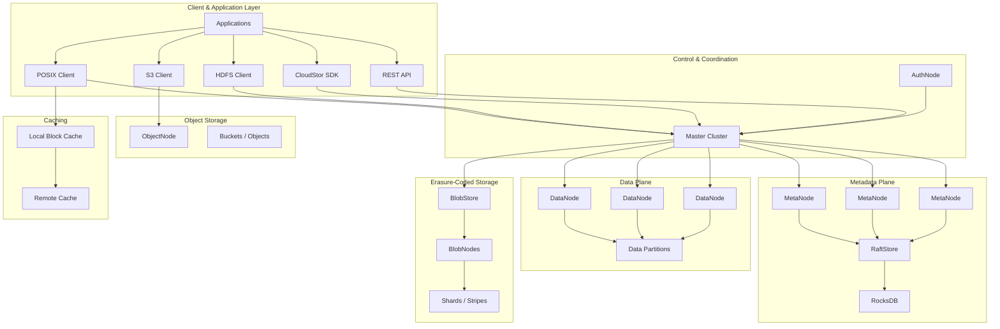

---

# Control Plane

The **Master subsystem** acts as the resource-management and coordination layer.

It is responsible for tasks such as:

* volume management
* data partition management
* metadata partition management
* node registration
* node health management
* cluster state
* partition placement
* balancing
* administrative operations
* consistency checks

Multiple Master nodes can participate in the control plane.

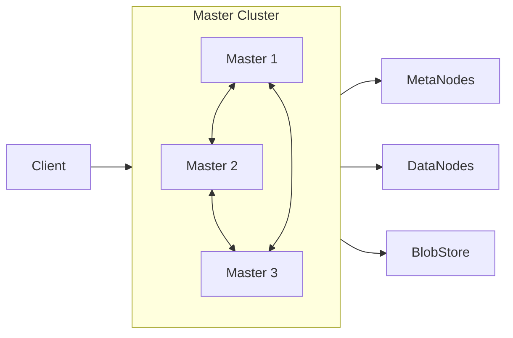

---

# Metadata Plane

The metadata subsystem is implemented through **MetaNodes**.

Metadata includes concepts such as:

* inode information
* directory entries
* metadata partitions
* volume metadata
* partition state
* file system namespace information

Each metadata partition represents a range of metadata and can be replicated for consistency.

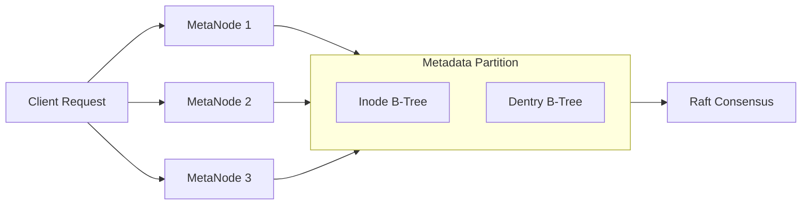

The MetaNode implementation maintains metadata managers, metadata partitions, Raft state, snapshots, metrics, and client/master communication.

---

# Data Plane

The data subsystem is responsible for the actual payload bytes.

Data is distributed across DataNodes.

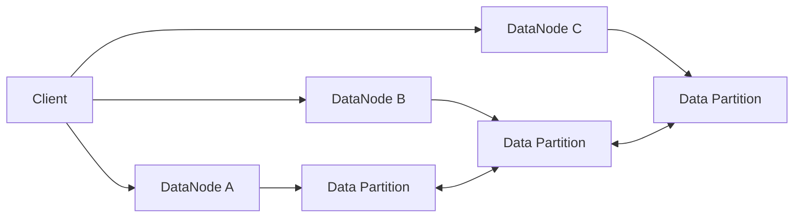

DataNodes provide:

* physical data storage
* data partitions
* disk management
* data repair
* health information
* metrics
* replication support
* storage capacity management

---

# Object Storage Plane

CloudStor includes an ObjectNode subsystem for object-oriented access.

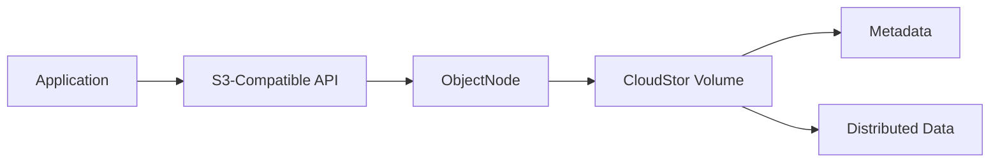

This enables object workloads to use familiar object-storage semantics while leveraging the distributed storage backend.

---

# End-to-End Data Flow

A simplified write path:

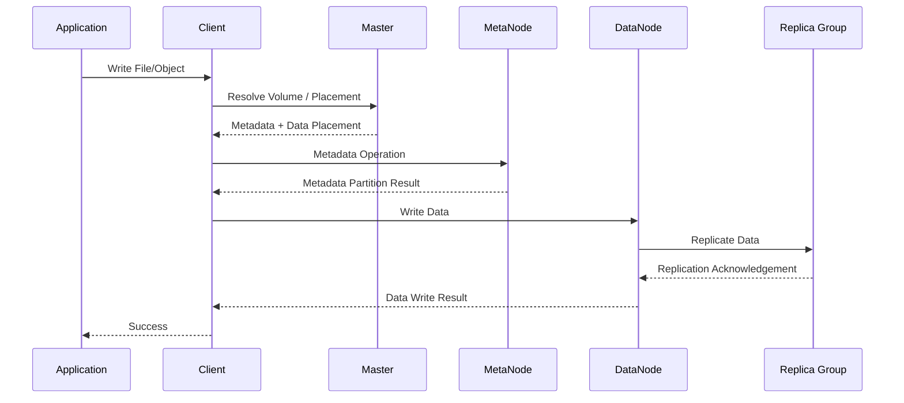

The key architectural separation is:

```text
                    WRITE REQUEST
                         │
                         ▼
                 ┌───────────────┐
                 │     Master    │
                 │   Placement   │
                 └───────┬───────┘
                         │
             ┌───────────┴───────────┐
             ▼                       ▼
       ┌───────────┐           ┌───────────┐
       │  MetaNode │           │  DataNode │
       │  Metadata │           │   Bytes   │
       └───────────┘           └─────┬─────┘
                                     │
                         ┌───────────┼───────────┐
                         ▼           ▼           ▼
                       Replica     Replica     Replica
```

---

# Quick Start

## Prerequisites

Recommended environment:

* Linux
* macOS
* WSL2
* Go 1.18+
* GCC / Clang
* Make
* Git
* Docker — optional
* Kubernetes + Helm — optional

The repository uses Go modules and includes native dependencies used by components such as RocksDB and compression libraries.

### Verify Go

```bash
go version
```

Recommended:

```text
go version go1.18+
```

### Verify build tools

```bash
git --version
go version
make --version
gcc --version
```

---

# Build from Source

Clone the repository:

```bash
git clone https://github.com/MeAkash77/CloudStor-Cloud-Native-Distributed-Storage-Data-Plane.git
cd CloudStor-Cloud-Native-Distributed-Storage-Data-Plane
```

Build the complete system:

```bash
make
```

or:

```bash
make build
```

The build system compiles the primary server, client, CLI, deployment tools, filesystem utilities, and BlobStore components.

Compiled binaries are placed under:

```text
build/bin/
```

---

# Build Individual Components

CloudStor exposes individual Make targets.

### Server

```bash
make server
```

Produces:

```text
build/bin/cfs-server
```

### Client

```bash
make client
```

Produces:

```text
build/bin/cfs-client
```

### CLI

```bash
make cli
```

Produces:

```text
build/bin/cfs-cli
```

### Authentication Tool

```bash
make authtool
```

Produces:

```text
build/bin/cfs-authtool
```

### Filesystem Check Utility

```bash
make fsck
```

Produces:

```text
build/bin/cfs-fsck
```

### BlobStore

```bash
make blobstore
```

### Deployment Tool

```bash
make deploy
```

### SDK

```bash
make libsdk
```

---

# Build Architecture

The build system automatically prepares required native dependencies and produces the CloudStor binaries.

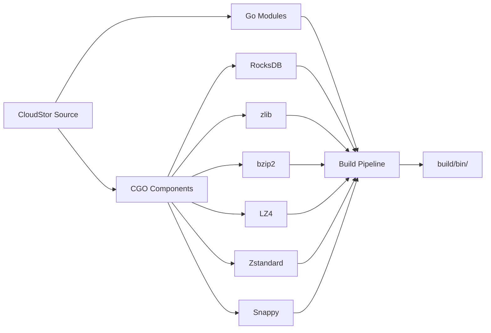

---

# Docker Deployment

CloudStor includes Docker support for running a cluster in a containerized environment.

Build and run:

```bash
docker/run_docker.sh -r -d /data/disk
```

The storage path can be changed:

```bash
docker/run_docker.sh -r -d /your/storage/path
```

The storage directory should have sufficient free disk capacity for the cluster workload.

---

## Docker Components

The Docker environment can be used to run:

```text
Master
MetaNode
DataNode
Client
Monitoring
```

Individual services can also be started separately.

```bash
docker/run_docker.sh -b
docker/run_docker.sh -s -d /data/disk
docker/run_docker.sh -c
docker/run_docker.sh -m
```

View available options:

```bash
docker/run_docker.sh -h
```

---

# Core Components

## 1. Master

Directory:

```text
master/
```

The Master subsystem is responsible for cluster-level resource management.

Responsibilities include:

* node registration
* volume management
* partition management
* placement decisions
* health management
* cluster coordination
* balancing
* administrative APIs

Conceptually:

```text
                  MASTER CLUSTER
          ┌────────────┬────────────┐
          │            │            │
       Master 1      Master 2      Master 3
          │            │            │
          └────────────┼────────────┘
                       │
        ┌──────────────┼──────────────┐
        ▼              ▼              ▼
    MetaNodes       DataNodes      BlobStore
```

---

# 2. MetaNode

Directory:

```text
metanode/
```

MetaNodes manage filesystem metadata.

The implementation includes:

* metadata partitions
* inode structures
* dentry structures
* metadata managers
* partition snapshots
* Raft integration
* metrics
* metadata persistence
* partition recovery

The metadata subsystem is designed for horizontal scaling.

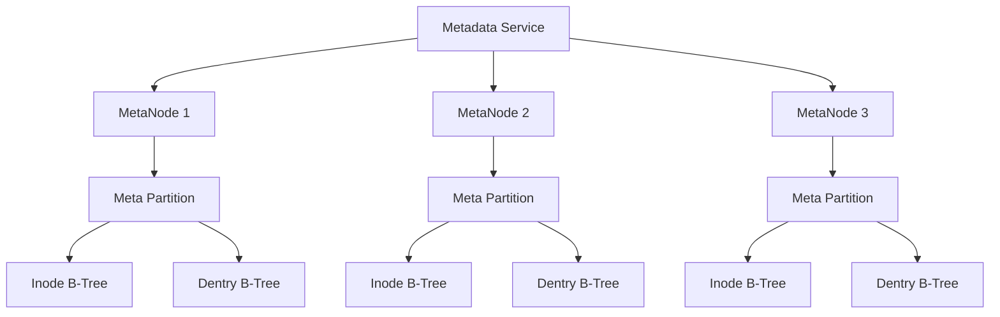

---

# 3. DataNode

Directory:

```text
datanode/
```

DataNodes provide the primary distributed data storage layer.

Responsibilities include:

* storing data partitions
* disk management
* data replication
* repair
* node health
* capacity tracking
* storage metrics
* read/write processing

```text
             DATA PLANE

       ┌─────────────────────┐
       │      DataNode       │
       ├─────────────────────┤
       │ Partition Manager   │
       │ Disk Manager        │
       │ Repair Manager      │
       │ Metrics             │
       │ Storage Engine      │
       └──────────┬──────────┘
                  │
         ┌────────┼────────┐
         ▼        ▼        ▼
       Disk 1   Disk 2   Disk 3
```

---

# 4. ObjectNode

Directory:

```text
objectnode/
```

ObjectNode provides object-storage functionality.

It handles:

* object requests
* bucket operations
* object metadata
* ACL-related operations
* object access APIs
* integration with the distributed storage layer

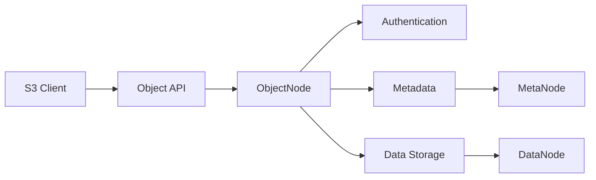

---

# 5. BlobStore

Directory:

```text
blobstore/
```

BlobStore provides the erasure-coded storage subsystem.

It contains components for:

* BlobNodes
* shard management
* access services
* scheduling
* proxying
* cluster management
* blobstore CLI
* repair
* shard operations
* storage tooling

The architecture can be visualized as:

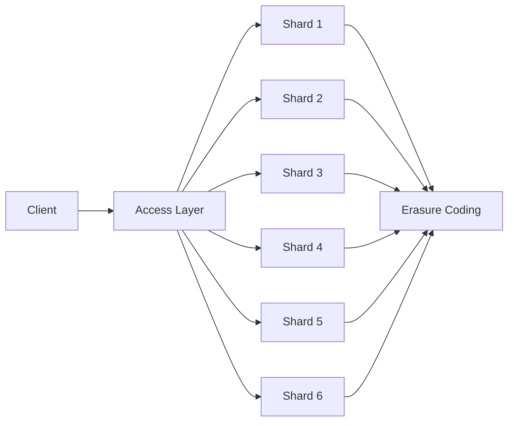

---

# 6. RaftStore

Directory:

```text
raftstore/
```

RaftStore provides the distributed consensus foundation used by metadata partitions and cluster components.

It includes:

* Raft partitions
* Raft logs
* persistent storage
* snapshot support
* monitoring
* partition state management

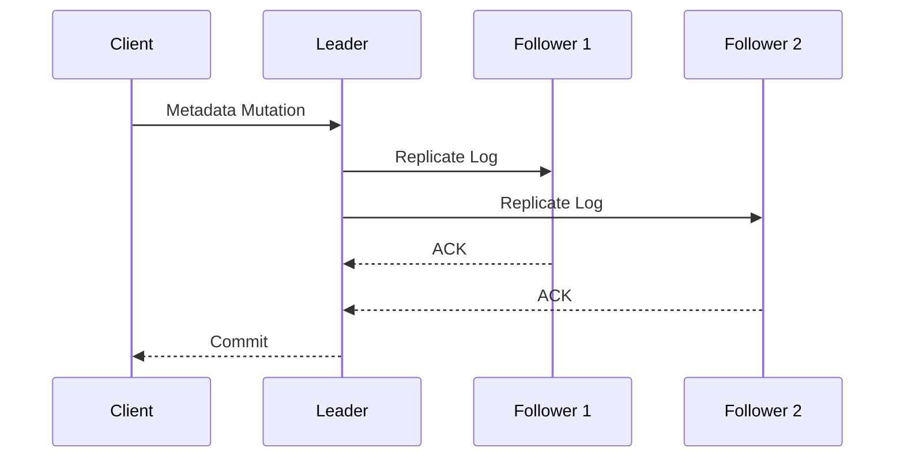

---

# 7. Client & SDK

Directories:

```text
client/
sdk/
```

The client layer provides access to distributed storage services.

The SDK layer includes interfaces for:

* authentication
* metadata APIs
* data APIs
* BlobStore
* object access
* cluster interaction

This separation allows applications to communicate with CloudStor without directly managing internal storage components.

---

# 8. AuthNode

Directory:

```text
authnode/
```

AuthNode provides authentication and credential-related functionality.

It contains:

* authentication APIs
* cluster handling
* key-store management
* snapshots
* authentication tooling
* HTTP services

---

# 9. Remote Cache

Directory:

```text
remotecache/
```

CloudStor contains remote caching components designed to accelerate access to frequently accessed data.

The cache architecture can include:

```text
Application
     │
     ▼
Local Cache
     │
     ▼
Remote Cache
     │
     ▼
Distributed Storage
```

This allows frequently accessed blocks to avoid repeatedly traversing the full storage path.

---

# Storage Architecture

CloudStor supports multiple storage strategies.

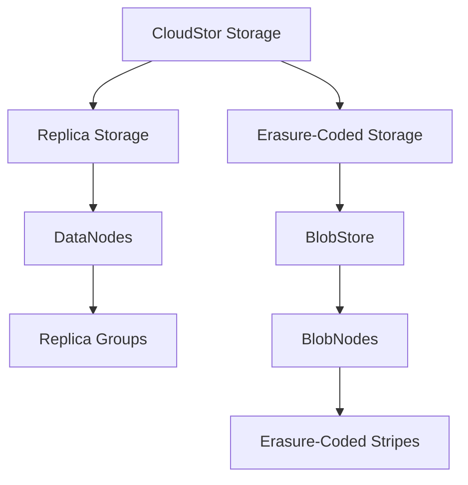

---

# Replica Storage

Replica-based storage maintains multiple copies of data.

```text
                    DATA
                     │
             ┌───────┼───────┐
             ▼       ▼       ▼
          Replica  Replica  Replica
             │       │       │
           Node A   Node B   Node C
```

Advantages:

* straightforward recovery
* high read availability
* strong redundancy
* predictable access behavior

Replication is particularly useful for workloads where latency and availability are more important than raw storage efficiency.

---

# Erasure-Coded Storage

Erasure coding divides data into fragments and generates parity information.

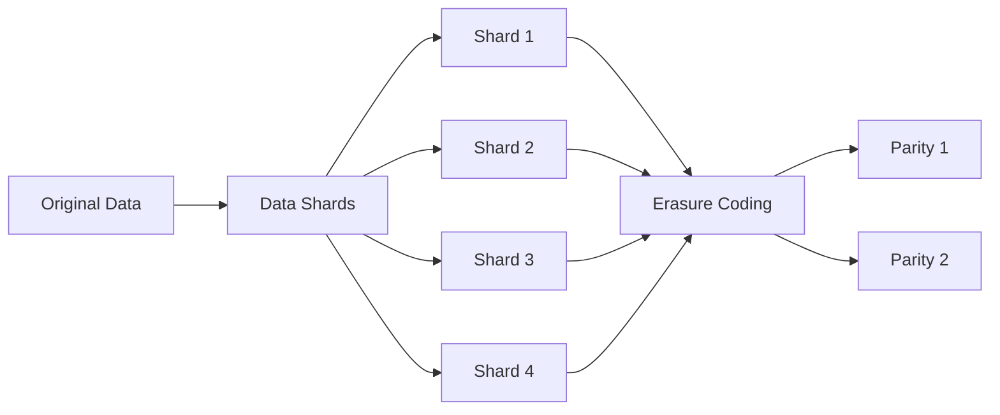

Erasure coding provides:

* storage efficiency
* fault tolerance
* scalable capacity
* large-scale object/data storage

---

# Hybrid Storage

Replica and erasure-coded storage can coexist.

```text
                 CloudStor
                    │
        ┌───────────┴───────────┐
        │                       │
        ▼                       ▼
   Replica Engine         Erasure Engine
        │                       │
     DataNode                BlobStore
        │                       │
   Replica Groups          EC Stripes
```

This allows storage policies to be selected according to workload requirements.

---

# Metadata Management

CloudStor separates metadata from payload data.

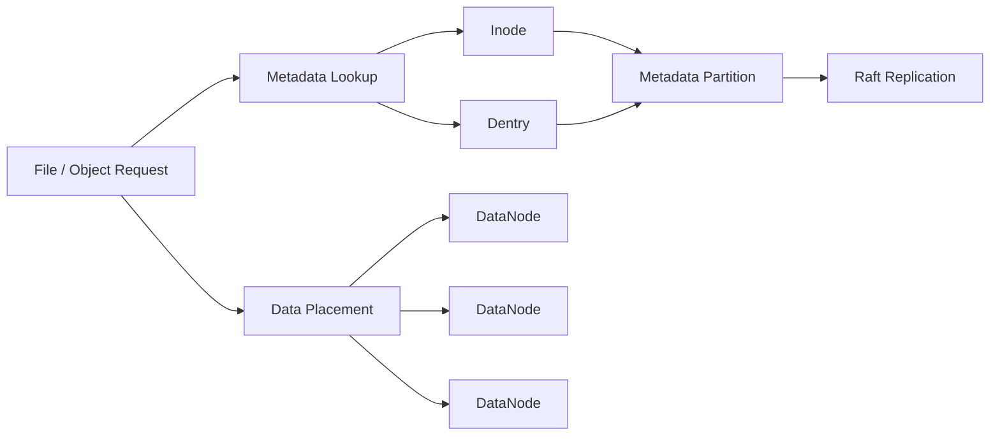

This architecture allows metadata and data capacity to scale independently.

---

# Metadata Consistency & Raft

Metadata operations require strong consistency.

CloudStor uses Raft-based replication for metadata partitions.

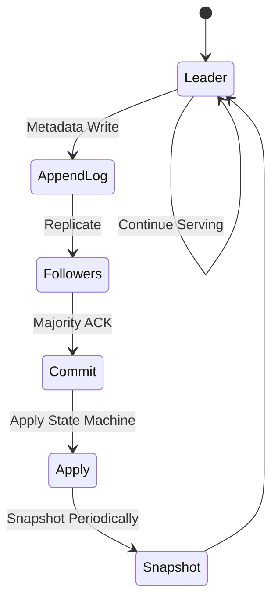

The important properties are:

* replicated metadata
* leader-based writes
* quorum acknowledgement
* persistent logs
* snapshots
* recovery after failures

---

# Data Placement & Partitioning

CloudStor divides storage into logical partitions.

```text
                  VOLUME
                    │
        ┌───────────┴───────────┐
        │                       │
 Metadata Partitions       Data Partitions
        │                       │
   ┌────┼────┐             ┌────┼────┐
   ▼    ▼    ▼             ▼    ▼    ▼
  MP1  MP2  MP3            DP1  DP2  DP3
```

The Master subsystem coordinates placement and cluster state.

Partitioning provides:

* horizontal scalability
* workload distribution
* fault isolation
* parallel I/O
* incremental recovery

---

# Fault Tolerance & Recovery

Distributed storage systems must assume that failures will occur.

CloudStor includes mechanisms for handling:

* DataNode failures
* MetaNode failures
* partition failures
* replica failures
* metadata recovery
* data repair
* node health changes
* snapshot restoration

A simplified failure-recovery path:

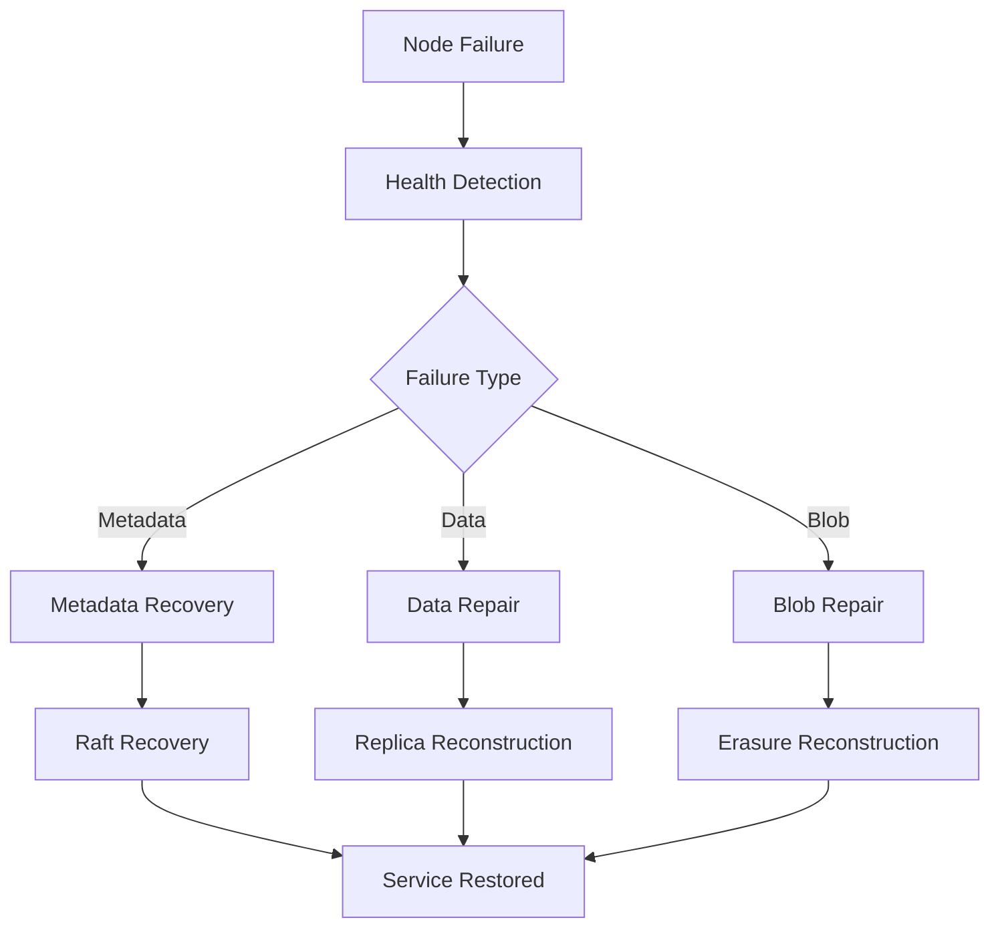

---

# Multi-Protocol Access

CloudStor is designed around multiple access protocols.

| Protocol | Purpose                      |
| -------- | ---------------------------- |
| POSIX    | File-system style workloads  |
| HDFS     | Hadoop / analytics workloads |
| S3       | Object storage               |
| REST API | Service-level access         |
| SDK      | Application integration      |

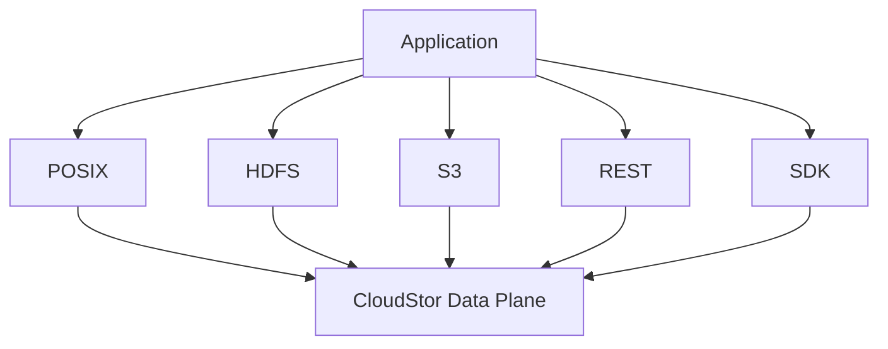

---

# Object Storage

CloudStor can expose distributed storage through object semantics.

```text
                 S3 Client
                    │
                    ▼
              ┌───────────┐
              │ ObjectNode│
              └─────┬─────┘
                    │
            ┌───────┴───────┐
            ▼               ▼
       Object Metadata   Object Data
            │               │
         MetaNode         DataNode
                            │
                       BlobStore / Replica
```

This allows the underlying distributed storage infrastructure to support object-oriented workloads without requiring a separate storage backend.

---

# Caching Architecture

CloudStor includes multiple cache-oriented components.

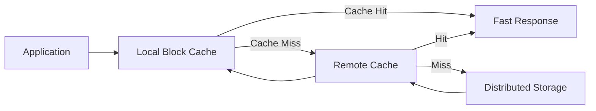

The purpose is to reduce repeated network and storage operations for frequently accessed data.

---

# Multi-Tenancy

CloudStor supports multi-tenant storage scenarios.

Conceptually:

```text
                    CloudStor Cluster
                           │
          ┌────────────────┼────────────────┐
          │                │                │
       Tenant A          Tenant B          Tenant C
          │                │                │
      Volume A1        Volume B1        Volume C1
      Volume A2        Volume B2        Volume C2
          │                │                │
          └────────────────┼────────────────┘
                           │
                    Shared Storage
```

Tenant-aware architecture enables:

* resource isolation
* volume isolation
* access control
* independent workloads
* improved cluster utilization

---

# Cloud-Native Architecture

CloudStor is designed to operate as a distributed infrastructure service rather than a single-machine application.

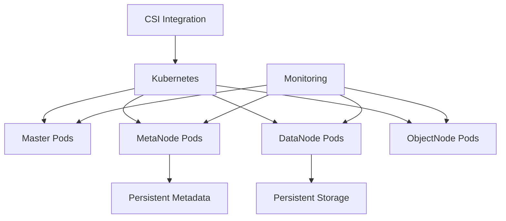

Cloud-native capabilities include:

* containerized services
* Kubernetes deployment
* Helm configuration
* CSI integration
* scalable nodes
* persistent volumes
* monitoring
* service orchestration

---

# Kubernetes Deployment

CloudStor includes Kubernetes-oriented deployment support.

Requirements:

* Kubernetes 1.12+
* Helm 3
* Kubernetes cluster access
* kubeconfig

Clone the Helm deployment repository/configuration as required by the deployment setup.

```bash
git clone https://github.com/cubefs/cubefs-helm
cd cubefs-helm
```

Copy kubeconfig:

```bash
cp ~/.kube/config cubefs/config/kubeconfig
```

Example configuration:

```yaml
path:
  data: /cubefs/data
  log: /cubefs/log

datanode:
  disks:
    - /data0:21474836480
    - /data1:21474836480

metanode:
  total_mem: "26843545600"

provisioner:
  kubelet_path: /var/lib/kubelet
```

Label Kubernetes nodes:

```bash
kubectl label node <nodename> cubefs-master=enabled
kubectl label node <nodename> cubefs-metanode=enabled
kubectl label node <nodename> cubefs-datanode=enabled
kubectl label node <nodename> cubefs-csi-node=enabled
```

Deploy:

```bash
helm install cubefs ./cubefs -f ~/cubefs.yaml
```

---

# Docker Deployment

For local experimentation, Docker provides a convenient way to create a storage cluster.

```bash
docker/run_docker.sh -r -d /data/disk
```

Check the mounted filesystem:

```bash
mount | grep cubefs
```

Monitoring can be exposed through Grafana in the provided Docker environment.

```text
Grafana
   │
   ▼
Cluster Metrics
   │
   ├── Master
   ├── MetaNode
   ├── DataNode
   └── Storage
```

---

# Observability

CloudStor includes Prometheus-oriented metrics and monitoring infrastructure.

The architecture is:

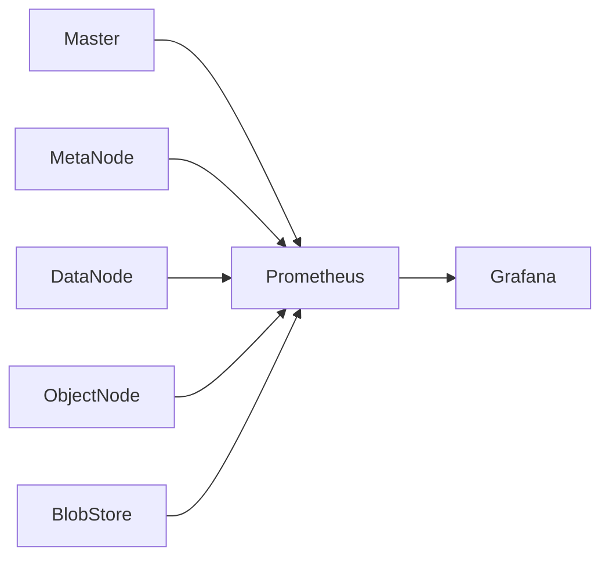

Monitoring can expose information related to:

* node health
* storage capacity
* request behavior
* partition state
* data operations
* metadata operations
* resource utilization
* repair activity

---

# Security

Security-related components are located under:

```text
security/
authnode/
```

The architecture includes:

* authentication services
* credential/key management
* authorization-related APIs
* audit/security documentation
* authentication tooling

A simplified security path:

```mermaid
flowchart LR

    CLIENT["Client"]

    CLIENT --> AUTH["Authentication"]
    AUTH --> AUTHNODE["AuthNode"]

    AUTHNODE --> TOKEN["Credentials / Token"]

    TOKEN --> API["Storage API"]

    API --> POLICY["Access Policy"]

    POLICY --> STORAGE["Storage Resources"]
```

---

# Project Structure

The repository is organized into specialized distributed-system components.

```text
CloudStor/
│
├── master/              # Cluster/resource management
├── metanode/             # Metadata management
├── datanode/             # Distributed data storage
├── objectnode/           # Object storage gateway
├── blobstore/            # Erasure-coded storage subsystem
├── raftstore/            # Raft consensus and replicated state
│
├── client/               # Client-side filesystem/data access
├── sdk/                  # Application SDKs
├── authnode/             # Authentication services
├── remotecache/          # Remote caching
├── lcnode/               # Lifecycle-related storage components
│
├── proto/                # Protocol and shared definitions
├── util/                 # Shared utilities
├── security/             # Security documentation
├── deploy/               # Deployment utilities
├── docker/               # Docker deployment
├── build/                # Build system
│
├── cmd/                  # Runtime configuration
├── cli/                  # Administrative CLI
├── shell/                # Shell utilities
├── tool/                 # Operational tools
│
├── test/                 # Test infrastructure
├── docs/                 # Documentation
├── docs-zh/              # Chinese documentation
│
├── depends/              # Native/build dependencies
├── vendor/               # Vendored dependencies
│
├── Makefile              # Build orchestration
├── go.mod                # Go module definition
├── go.sum                # Dependency checksums
├── INSTALL.md            # Installation instructions
├── HELM.md               # Kubernetes / Helm deployment
└── LICENSE               # Apache 2.0 license
```

---

# Implementation Highlights

## Distributed Metadata

Metadata is partitioned across MetaNodes and maintained using replicated state.

Key structures include:

* inode metadata
* directory entries
* metadata partitions
* snapshots
* Raft state

---

## Distributed Data

Data is divided across storage partitions and distributed among DataNodes.

This enables:

* horizontal expansion
* distributed I/O
* replica placement
* recovery
* data repair

---

## Raft-Based Consistency

RaftStore provides:

* replicated logs
* leader/follower state
* persistence
* snapshots
* partition-level consensus

---

## Erasure Coding

BlobStore provides a dedicated storage subsystem for erasure-coded data.

This separates:

```text
Replica Storage
       +
Erasure-Coded Storage
```

instead of forcing every workload into a single storage strategy.

---

## Multi-Level Caching

Caching components allow frequently accessed data to be served closer to compute.

```text
Application
     │
     ▼
Local Cache
     │
     ▼
Remote Cache
     │
     ▼
Distributed Storage
```

---

## Object Storage

ObjectNode enables S3-style access on top of the distributed storage system.

---

## Cloud-Native Deployment

Deployment support includes:

* Docker
* Kubernetes
* Helm
* CSI
* monitoring
* persistent storage

---

# Testing

The repository includes extensive Go test coverage throughout its distributed components.

Run the project test target:

```bash
make test
```

Coverage-related targets are also available:

```bash
make testcover
```

```bash
make testcovercubefs
```

```bash
make testcoverblobstore
```

Individual package tests can be executed with:

```bash
go test ./...
```

For focused testing:

```bash
go test ./master/...
```

```bash
go test ./metanode/...
```

```bash
go test ./datanode/...
```

```bash
go test ./objectnode/...
```

```bash
go test ./raftstore/...
```

---

# CI/CD & Engineering Practices

The project includes automated engineering infrastructure under:

```text
.github/
```

Relevant workflows include:

* continuous integration
* CodeQL
* dependency updates
* release testing
* security scanning
* release automation
* project health checks

The repository also contains configuration for:

```text
GitHub Actions
GitLab CI
Travis CI
GoReleaser
CodeQL
Dependabot
Semgrep
OpenSSF Scorecard
Codecov
```

---

# Performance Design

CloudStor's architecture focuses on performance at multiple layers.

## Metadata Performance

Metadata is managed through in-memory structures and indexed access patterns.

```text
Request
   │
   ▼
MetaNode
   │
   ├── Inode Index
   └── Dentry Index
```

---

## Sequential I/O

Sequential workloads can use optimized data paths and replication mechanisms.

```text
Client
  │
  ▼
Sequential Write
  │
  ▼
Data Partition
  │
  ├── Replica
  ├── Replica
  └── Replica
```

---

## Random I/O

Random writes can require stronger coordination and partition-level consistency.

```text
Random Write
     │
     ▼
Partition
     │
     ▼
Consistency Layer
     │
     ▼
Replicated State
```

---

## Caching

Hot data can be served through local or remote cache layers.

```text
Hot Data
   │
   ▼
Cache
   │
   └── Reduced Storage Traversal
```

---

# Use Cases

CloudStor's architecture is applicable to several distributed-storage workloads.

## AI / Machine Learning

Suitable infrastructure for:

* training datasets
* model storage
* checkpoint storage
* distributed inference data
* shared datasets

```text
AI Workers
    │
    ▼
CloudStor
    │
 ┌──┼──────────┐
 ▼  ▼          ▼
Data Cache  Distributed Storage
```

---

## Big Data

Compatible storage semantics can support:

* analytics
* data lakes
* Hadoop-oriented workloads
* distributed compute engines

---

## Container Storage

Cloud-native deployment enables shared storage for containerized workloads.

```text
Kubernetes
    │
    ▼
CSI
    │
    ▼
CloudStor
    │
    ▼
Persistent Storage
```

---

## Database Storage

CloudStor can serve as distributed storage infrastructure for systems where storage and compute are separated.

```text
Database Compute
       │
       ▼
CloudStor Storage
       │
       ├── Metadata
       ├── Data
       ├── Replication
       └── Recovery
```

---

## Object Storage

Object workloads can use the ObjectNode/S3-compatible access path.

---

# Engineering Concepts Demonstrated

This project demonstrates practical distributed-systems concepts including:

### Distributed Systems

* horizontal scalability
* partitioning
* replication
* consensus
* failure detection
* recovery
* distributed state management

### Storage Systems

* metadata/data separation
* filesystem semantics
* object storage
* block storage
* erasure coding
* caching
* disk management

### Algorithms & Data Structures

* B-Trees
* Raft
* partitioning
* replication protocols
* erasure coding
* hashing
* indexing
* state machines

### Backend Engineering

* Go
* RPC/API design
* concurrent services
* persistent storage
* background workers
* metrics
* distributed coordination

### Cloud Engineering

* Docker
* Kubernetes
* Helm
* CSI
* persistent volumes
* service orchestration
* monitoring

---

# End-to-End System Model

The complete CloudStor system can be understood as five major layers.

```mermaid
flowchart TB

    A["Application Layer"]

    A --> ACCESS["Access Layer"]

    ACCESS --> CONTROL["Control Plane"]

    CONTROL --> META["Metadata Plane"]

    CONTROL --> DATA["Data Plane"]

    META --> CONSENSUS["Consensus / Persistence"]

    DATA --> REPL["Replication"]
    DATA --> EC["Erasure Coding"]
    DATA --> CACHE["Caching"]

    REPL --> STORAGE["Physical Storage"]
    EC --> STORAGE
    CACHE --> STORAGE
    CONSENSUS --> STORAGE
```

---

# Request Lifecycle

A typical filesystem request can be modeled as:

```mermaid
sequenceDiagram

    participant APP as Application
    participant CLI as Client
    participant MASTER as Master
    participant META as MetaNode
    participant DATA as DataNode

    APP->>CLI: File Operation

    CLI->>MASTER: Resolve Volume
    MASTER-->>CLI: Placement Information

    CLI->>META: Metadata Operation
    META-->>CLI: Metadata Result

    CLI->>DATA: Data Operation
    DATA-->>CLI: Data Result

    CLI-->>APP: Response
```

---

# Failure Scenario

Consider a DataNode failure.

```mermaid
sequenceDiagram

    participant M as Master
    participant D1 as DataNode A
    participant D2 as DataNode B
    participant D3 as DataNode C

    D1->>M: Heartbeat
    M-->>D1: OK

    Note over D1: Node becomes unavailable

    M->>D1: Health Check
    D1--xM: No Response

    M->>D2: Inspect Replica
    M->>D3: Inspect Replica

    D2-->>M: Replica Available
    D3-->>M: Replica Available

    M->>D2: Repair / Re-replicate
    M->>D3: Repair / Re-replicate

    Note over M,D3: Storage returns to healthy state
```

This illustrates why distributed storage requires independent coordination, data placement, replication, and repair subsystems.

---

# Deployment Architecture

A production-style deployment can be modeled as:

```mermaid
flowchart TB

    USER["Users / Applications"]

    LB["Load Balancer / Gateway"]

    USER --> LB

    LB --> OBJ["ObjectNode"]
    LB --> API["Storage API"]

    subgraph CLUSTER["CloudStor Cluster"]

        MASTER["Master Cluster"]

        META["MetaNode Cluster"]

        DATA["DataNode Cluster"]

        BLOB["BlobStore Cluster"]

        CACHE["Cache Layer"]
    end

    API --> MASTER
    OBJ --> MASTER

    MASTER --> META
    MASTER --> DATA
    MASTER --> BLOB

    DATA --> CACHE
    CACHE --> DATA
```

---

# Local Development Architecture

For development, the system can be run using a simplified environment.

```text
Developer Machine
│
├── CloudStor Source
│
├── Go Toolchain
│
├── Native Dependencies
│
├── build/
│   └── bin/
│
├── Docker
│
└── Optional Kubernetes Cluster
```

Recommended development workflow:

```bash
git clone <repository>
cd CloudStor-Cloud-Native-Distributed-Storage-Data-Plane

go version

make

make test
```

---

# Development Workflow

A typical contributor workflow:

```mermaid
flowchart LR

    CODE["Modify Code"]
    FORMAT["Format"]
    TEST["Run Tests"]
    BUILD["Build"]
    DOCKER["Docker Test"]
    PR["Pull Request"]

    CODE --> FORMAT
    FORMAT --> TEST
    TEST --> BUILD
    BUILD --> DOCKER
    DOCKER --> PR
```

---

# Operational Tooling

The repository includes several operational utilities.

Examples include:

```text
cfs-server
cfs-client
cfs-cli
cfs-authtool
cfs-fsck
cfs-deploy
```

These tools cover different operational responsibilities including:

* service startup
* client access
* administration
* authentication
* filesystem checks
* deployment

---

# CLI

The administrative CLI is built with:

```bash
make cli
```

The resulting binary:

```text
build/bin/cfs-cli
```

Use the CLI for cluster-level administrative and operational tasks supported by the implementation.

---

# Filesystem Checking

The filesystem-checking utility can be built with:

```bash
make fsck
```

Output:

```text
build/bin/cfs-fsck
```

This provides operational tooling for validating and inspecting storage state.

---

# Authentication Tooling

Build:

```bash
make authtool
```

Output:

```text
build/bin/cfs-authtool
```

This provides command-line authentication-related operations.

---

# Implementation Status

## Core Infrastructure

* ✅ Distributed Master subsystem
* ✅ MetaNode subsystem
* ✅ DataNode subsystem
* ✅ ObjectNode subsystem
* ✅ RaftStore
* ✅ Replica storage
* ✅ Erasure-coded BlobStore
* ✅ Client subsystem
* ✅ SDK
* ✅ Authentication subsystem
* ✅ Remote caching
* ✅ Docker deployment
* ✅ Kubernetes/Helm deployment support
* ✅ Prometheus-oriented monitoring
* ✅ Operational CLI tooling

---

# Repository Scale

The codebase is organized as a large multi-component distributed-storage system rather than a single application.

Major subsystems include:

```text
Master
MetaNode
DataNode
ObjectNode
BlobStore
RaftStore
Client
SDK
AuthNode
RemoteCache
Deployment
Docker
Kubernetes
CLI
Testing
Monitoring
Security
```

This separation is intentional: each subsystem owns a specific part of the distributed storage lifecycle.

---

# Design Principles

CloudStor follows several important distributed-storage principles.

## Separation of Control and Data

```text
Control Plane
     │
     ├── Placement
     ├── Metadata
     ├── Health
     └── Coordination

Data Plane
     │
     ├── Reads
     ├── Writes
     ├── Replication
     └── Storage
```

---

## Horizontal Scalability

Instead of vertically scaling one storage process:

```text
           Single Server
               │
               ▼
          Limited Capacity
```

CloudStor distributes workloads:

```text
              Cluster
     ┌──────────┼──────────┐
     ▼          ▼          ▼
   Node A     Node B     Node C
     │          │          │
     └──────────┼──────────┘
                ▼
        Shared Storage Fabric
```

---

## Failure as a Normal Event

The architecture assumes:

```text
Nodes fail
Disks fail
Partitions fail
Networks fail
Processes restart
```

Therefore:

```text
Failure
   │
   ▼
Detection
   │
   ▼
Recovery
   │
   ▼
Repair
   │
   ▼
Healthy Cluster
```

---

# Performance Model

CloudStor's performance comes from combining several techniques:

```text
                    PERFORMANCE
                         │
       ┌─────────────────┼─────────────────┐
       │                 │                 │
       ▼                 ▼                 ▼
   Parallel I/O      Caching          Partitioning
       │                 │                 │
       ▼                 ▼                 ▼
 Replication        Local/Remote      Horizontal
                    Cache             Scaling
       │
       ▼
   Distributed
    Storage
```

---

# Storage / Compute Separation

One of the important architectural use cases is separating compute from storage.

```mermaid
flowchart LR

    subgraph COMPUTE["Compute Layer"]
        C1["Database"]
        C2["AI Training"]
        C3["Analytics"]
        C4["Search"]
    end

    subgraph STORAGE["CloudStor"]
        META["Metadata"]
        DATA["Data"]
        CACHE["Cache"]
        EC["Erasure Coding"]
        REPL["Replication"]
    end

    C1 --> STORAGE
    C2 --> STORAGE
    C3 --> STORAGE
    C4 --> STORAGE
```

This allows compute resources and storage resources to evolve independently.

---

# CloudStor at a Glance

```text
┌─────────────────────────────────────────────────────────────┐
│                         CloudStor                           │
│                                                             │
│  Cloud-Native Distributed Storage Data Plane                │
│                                                             │
├─────────────────────────────────────────────────────────────┤
│                                                             │
│  ACCESS                                                     │
│  ├── POSIX                                                   │
│  ├── HDFS                                                    │
│  ├── S3                                                      │
│  ├── REST                                                    │
│  └── SDK                                                     │
│                                                             │
├─────────────────────────────────────────────────────────────┤
│                                                             │
│  CONTROL                                                    │
│  ├── Master                                                  │
│  └── Authentication                                          │
│                                                             │
├─────────────────────────────────────────────────────────────┤
│                                                             │
│  METADATA                                                   │
│  ├── MetaNode                                                │
│  ├── Inode / Dentry                                          │
│  ├── Raft                                                    │
│  └── Persistent State                                        │
│                                                             │
├─────────────────────────────────────────────────────────────┤
│                                                             │
│  DATA                                                        │
│  ├── DataNode                                                 │
│  ├── Replication                                              │
│  ├── Partitioning                                             │
│  └── Repair                                                   │
│                                                             │
├─────────────────────────────────────────────────────────────┤
│                                                             │
│  ERASURE CODE                                                │
│  ├── BlobStore                                                │
│  ├── BlobNode                                                 │
│  └── Shards                                                   │
│                                                             │
├─────────────────────────────────────────────────────────────┤
│                                                             │
│  PERFORMANCE                                                 │
│  ├── Local Cache                                              │
│  ├── Remote Cache                                             │
│  └── Parallel I/O                                             │
│                                                             │
├─────────────────────────────────────────────────────────────┤
│                                                             │
│  CLOUD NATIVE                                                │
│  ├── Docker                                                   │
│  ├── Kubernetes                                               │
│  ├── Helm                                                     │
│  ├── CSI                                                      │
│  └── Prometheus                                               │
│                                                             │
└─────────────────────────────────────────────────────────────┘
```

---

# Engineering Concepts Demonstrated

This project is particularly useful for studying:

```text
Distributed Systems
        │
        ├── Raft Consensus
        ├── Replication
        ├── Partitioning
        ├── Failure Recovery
        ├── Leader Election
        └── Distributed State

Storage Systems
        │
        ├── Metadata Management
        ├── Data Placement
        ├── Filesystem Semantics
        ├── Object Storage
        ├── Erasure Coding
        └── Caching

Backend Systems
        │
        ├── Go
        ├── Concurrent Services
        ├── APIs
        ├── Persistent Storage
        └── Service Coordination

Cloud Infrastructure
        │
        ├── Docker
        ├── Kubernetes
        ├── Helm
        ├── CSI
        └── Monitoring
```

---

# Contributing

Contributions should focus on:

* distributed storage correctness
* metadata scalability
* data placement
* fault recovery
* storage performance
* caching
* observability
* cloud-native deployment
* testing
* documentation

Before submitting changes:

```bash
make test
```

Build the project:

```bash
make
```

For focused package testing:

```bash
go test ./path/to/package/...
```

---

# License

This project is distributed under the **Apache License 2.0**.

See:

```text
LICENSE
NOTICE
```

for the applicable license and attribution information.

---

# Attribution

CloudStor is presented as a focused **cloud-native distributed storage data-plane project** built around the CubeFS distributed-storage architecture and source components.

The underlying architecture and implementation include the distributed-storage subsystems represented by:

* Master
* MetaNode
* DataNode
* ObjectNode
* BlobStore
* RaftStore
* Client
* SDK
* AuthNode
* Remote Cache
* Docker/Kubernetes deployment

The original CubeFS project and its contributors should be credited according to the repository's Apache 2.0 license and NOTICE requirements.

---

# Appendix: Architecture Glossary

### Master

Cluster-level resource management and coordination subsystem.

### MetaNode

Distributed metadata service responsible for filesystem metadata and metadata partitions.

### DataNode

Distributed storage node responsible for storing data partitions.

### ObjectNode

Object-storage gateway providing object-oriented access.

### BlobStore

Storage subsystem for erasure-coded data.

### BlobNode

Node responsible for storing BlobStore shards/blocks.

### RaftStore

Distributed consensus and replicated-state subsystem.

### Meta Partition

Logical partition containing a range of metadata.

### Data Partition

Logical partition containing a range of stored data.

### Replica Group

Multiple copies of a data partition distributed across storage nodes.

### Erasure Coding

A storage technique that distributes data and parity fragments across multiple nodes for fault tolerance and storage efficiency.

### Inode

Metadata structure representing a file or filesystem object.

### Dentry

Directory-entry metadata connecting names to filesystem objects.

### Volume

Logical storage unit containing metadata and data partitions.

### Object

Data represented through object-storage semantics.

### POSIX

Filesystem interface semantics used by traditional applications.

### HDFS

Hadoop Distributed File System interface compatibility.

### S3

Object-storage API semantics compatible with common S3 clients and tooling.

### CSI

Container Storage Interface used to integrate storage systems with Kubernetes.

### Multi-Tenancy

Ability to serve multiple isolated users, teams, or workloads from the same storage infrastructure.

### Multi-AZ

Deployment of storage resources across multiple availability zones.

### Data Plane

The portion of the system responsible for moving and storing actual application data.

### Control Plane

The portion responsible for cluster state, placement, coordination, and resource management.

### Metadata Plane

The subsystem responsible for namespace and filesystem metadata.

---

# Final Architecture

```mermaid
flowchart TB

    USERS["Applications / Users"]

    subgraph ACCESS["Access Layer"]
        POSIX["POSIX"]
        HDFS["HDFS"]
        S3["S3"]
        REST["REST"]
        SDK["SDK"]
    end

    subgraph CONTROL["Control Plane"]
        MASTER["Master Cluster"]
        AUTH["AuthNode"]
    end

    subgraph META["Metadata Plane"]
        META1["MetaNode"]
        META2["MetaNode"]
        META3["MetaNode"]
        RAFT["RaftStore"]
        ROCKS["RocksDB"]
    end

    subgraph DATA["Data Plane"]
        DN1["DataNode"]
        DN2["DataNode"]
        DN3["DataNode"]
        REPL["Replica Groups"]
    end

    subgraph EC["Erasure-Coded Plane"]
        BLOB["BlobStore"]
        BN1["BlobNode"]
        BN2["BlobNode"]
        BN3["BlobNode"]
        STRIPE["EC Stripes"]
    end

    subgraph CACHE["Caching Layer"]
        LOCAL["Local Cache"]
        REMOTE["Remote Cache"]
    end

    subgraph CLOUD["Cloud-Native Infrastructure"]
        DOCKER["Docker"]
        K8S["Kubernetes"]
        HELM["Helm"]
        CSI["CSI"]
        PROM["Prometheus"]
    end

    USERS --> ACCESS

    POSIX --> MASTER
    HDFS --> MASTER
    REST --> MASTER
    SDK --> MASTER
    S3 --> BLOB

    MASTER --> META1
    MASTER --> META2
    MASTER --> META3

    META1 --> RAFT
    META2 --> RAFT
    META3 --> RAFT

    RAFT --> ROCKS

    MASTER --> DN1
    MASTER --> DN2
    MASTER --> DN3

    DN1 --> REPL
    DN2 --> REPL
    DN3 --> REPL

    MASTER --> BLOB

    BLOB --> BN1
    BLOB --> BN2
    BLOB --> BN3

    BN1 --> STRIPE
    BN2 --> STRIPE
    BN3 --> STRIPE

    POSIX --> LOCAL
    LOCAL --> REMOTE
    REMOTE --> DATA

    K8S --> MASTER
    K8S --> META1
    K8S --> DN1
    K8S --> BLOB

    CSI --> K8S
    HELM --> K8S
    DOCKER --> CLOUD

    PROM --> MASTER
    PROM --> META1
    PROM --> DN1
    PROM --> BLOB

    AUTH --> MASTER
```

---

# CloudStor — Distributed Storage, Built as a System

CloudStor brings together the core ideas behind modern distributed storage:

```text
        Metadata
           +
       Consensus
           +
      Partitioning
           +
      Replication
           +
     Erasure Coding
           +
        Caching
           +
     Object Storage
           +
     Multi-Tenancy
           +
     Cloud-Native
           │
           ▼
   ┌───────────────────┐
   │     CloudStor     │
   │ Distributed Data  │
   │      Plane        │
   └───────────────────┘
```

The result is a storage architecture designed around **scalability, durability, fault tolerance, multiple access protocols, and cloud-native operation**.                                                                                                                                                                                               ## Overview

Cubestor is an open-source cloud-native distributed file & object storage system, hosted by the [Cloud Native Computing Foundation](https://cncf.io) (CNCF) as a [graduated](https://www.cncf.io/projects/) project.

## What can you build with Cubestor

* As an open-source distributed storage, CubeFS can serve as your datacenter filesystem, data lake storage infra, and private or hybrid cloud storage. 
* Moreover, it can be run in public cloud services, providing cache acceleration and file system semantics on top of public cloud storage such as S3.

* In particular, CubeFS enables the separation of storage/compute architecture for databases, search systems, and AI/ML applications.

Some key features of Cubestor include:

- Multiple access protocols such as POSIX, HDFS, S3, and its own REST API
- Highly scalable metadata service with strong consistency  
- Performance optimization of large/small files and sequential/random writes
- Multi-tenancy support with better resource utilization and tenant isolation
- Hybrid cloud I/O acceleration through multi-level caching
- Flexible storage policies, high-performance replication or low-cost erasure coding


<div width="100%" style="text-align:center;"></div>

## Governance

[Governance documentation](https://github.com/cubefs/cubefs/blob/master/GOVERNANCE.md) plays a crucial role in establishing clear guidelines, procedures, and structures within an organization or project

## Reference

Haifeng Liu, et al., CFS: A Distributed File System for Large Scale Container Platforms. SIGMOD‘19, June 30-July 5, 2019, Amsterdam, Netherlands. 

For more information, please refer to https://dl.acm.org/citation.cfm?doid=3299869.3314046 and https://arxiv.org/abs/1911.03001


## License

CubeFS is licensed under the [Apache License, Version 2.0](http://www.apache.org/licenses/LICENSE-2.0).
For detail see [LICENSE](LICENSE) and [NOTICE](NOTICE).

## Note

The master branch may be in an unstable or even broken state during development. Please use releases instead of the master branch in order to get a stable set of binaries.

